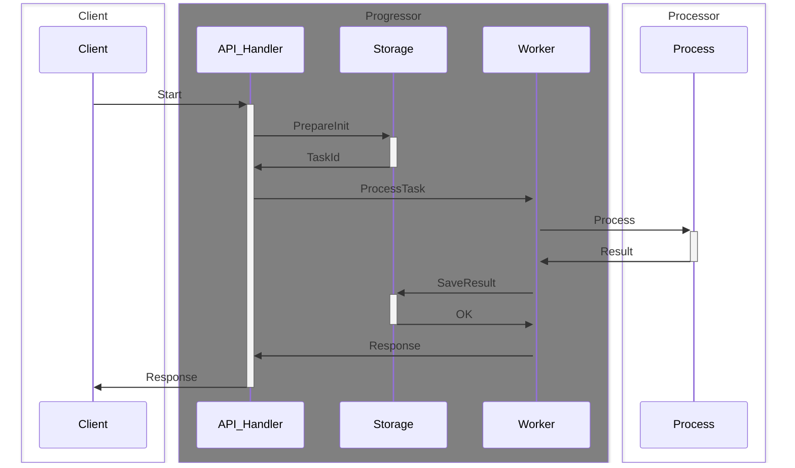

# progressor

## Использование
 TODO

## Мониторинг и логирование

Доступны следующие метрики:

- TYPE progressor_calls_scanning_duration_ms histogram
  HELP progressor_calls_scanning_duration_ms Calls (call, repair) scanning durations in millisecond
- TYPE progressor_timers_scanning_duration_ms histogram
  HELP progressor_timers_scanning_duration_ms Timers (timeout, remove) scanning durations in millisecond
- TYPE progressor_zombie_collection_duration_ms histogram
  HELP progressor_zombie_collection_duration_ms Zombie tasks collecting durations in millisecond
- TYPE progressor_request_preparing_duration_ms histogram
  HELP progressor_request_preparing_duration_ms Preparing request (init, call, repair) durations in millisecond
- TYPE progressor_task_processing_duration_ms histogram
  HELP progressor_task_processing_duration_ms Task processing durations in millisecond
- TYPE progressor_task_completion_duration_ms histogram
  HELP progressor_task_completion_duration_ms Task completion durations in millisecond
- TYPE progressor_process_removing_duration_ms histogram
  HELP progressor_process_removing_duration_ms Task completion durations in millisecond
- TYPE progressor_notification_duration_ms histogram
  HELP progressor_notification_duration_ms Notification durations in millisecond

## Базовые сценарии

Схема БД здесь: https://github.com/valitydev/progressor/blob/master/priv/schemas/postgres-schema.sql

### Старт экземпляра процесса



PrepareInit.sql
```sql
-- сохраняем новый процесс
INSERT INTO ProcessTable (process_id, status, detail, aux_state, metadata) VALUES ($1, $2, $3, $4, $5);

-- сохраняем задачу в историческую таблицу
INSERT INTO TaskTable
  (process_id, task_type, status, scheduled_time, running_time, args, metadata, idempotency_key,
    blocked_task, response, last_retry_interval, attempts_count, context)
  VALUES ($1, $2, $3, $4, $5, $6, $7, $8, $9, $10, $11, $12, $13) RETURNING task_id;

-- сохраняем задачу как запущенную
INSERT INTO RunningTable
  (task_id, process_id, task_type, status, scheduled_time, running_time, args, metadata,
    last_retry_interval, attempts_count, context)
  VALUES ($1, $2, $3, $4, $5, $6, $7, $8, $9, $10, $11)
  ON CONFLICT (process_id) DO NOTHING RETURNING task_id;
```
здесь и далее все примеры запросов выполняются транзакционно, то есть обернуты в BEGIN - COMMIT|ROLLBACK

В случае отсутствия свободных воркеров задача вместо RunningTable будет сохранена в ScheduleTable:
```sql
-- сохраняем задачу как запланированную
INSERT INTO ScheduleTable
  (task_id, process_id, task_type, status, scheduled_time, args, metadata,
    last_retry_interval, attempts_count, context)
  VALUES ($1, $2, $3, $4, $5, $6, $7, $8, $9, $10) RETURNING task_id;
```

Следующий запрос представлен для случая, когда процессор запланировал следующий вызов с нулевым таймаутом
(наиболее частый вариант)

SaveResult.sql
```sql
-- обновляем процесс
UPDATE ProcessesTable
  SET status = $1, detail = $2, aux_state = $3, metadata = $4, corrupted_by = $5
  WHERE process_id = $6;

-- сохраняем события
INSERT INTO EventsTable (process_id, task_id, event_id, timestamp, payload, metadata)
  VALUES ($1, $2, $3, $4, $5, $6);

-- отменяем ранее запланированные таймеры, так как получили новый
WITH deleted_tasks as(
  DELETE FROM ScheduleTable WHERE process_id = $1 AND task_type IN ('timeout', 'remove')
    AND (status = 'waiting' OR status = 'blocked') RETURNING task_id
  )
  MERGE INTO TaskTable as tt USING deleted_tasks as dt ON tt.task_id = dt.task_id
    WHEN MATCHED THEN UPDATE SET status = 'cancelled';

-- сохраняем новую задачу (вызов с нулевым таймаутом) в историческую таблицу
INSERT INTO TaskTable
  (process_id, task_type, status, scheduled_time, running_time, args, metadata, idempotency_key,
    blocked_task, response, last_retry_interval, attempts_count, context)
  VALUES ($1, $2, $3, $4, $5, $6, $7, $8, $9, $10, $11, $12, $13) RETURNING task_id;

-- финализируем завершёную задачу
WITH deleted AS(
  DELETE FROM RunningTable WHERE process_id = $4
)
UPDATE TaskTable SET status = $1, response = $2, finished_time = $3 WHERE task_id = $5;

-- проверяем не появились ли внешние вызовы за время процессинга
WITH postponed_tasks AS (
  DELETE FROM ScheduleTable WHERE task_id = (SELECT min(task_id) FROM ScheduleTable
      WHERE process_id = $1 AND status = 'waiting' AND task_type IN ('call', 'repair'))
    RETURNING task_id, process_id, task_type, 'running'::task_status as status, scheduled_time,
      TO_TIMESTAMP($2, 'YYYY-MM-DD HH24:MI:SS') as running_time, args, metadata,
      last_retry_interval, attempts_count, context
  )
INSERT INTO RunningTable (task_id, process_id, task_type, status, scheduled_time, running_time, args,
  metadata, last_retry_interval, attempts_count, context) SELECT * FROM postponed_tasks RETURNING *;

-- сохраняем новую задачу как запущенную
-- при условии, что предыдущий запрос вернул пустую таблицу, иначе сохраняем как запланированную
INSERT INTO RunningTable
  (task_id, process_id, task_type, status, scheduled_time, running_time, args, metadata,
    last_retry_interval, attempts_count, context)
  VALUES ($1, $2, $3, $4, $5, $6, $7, $8, $9, $10, $11)
  ON CONFLICT (process_id) DO NOTHING RETURNING task_id;
```

### Вызов экземпляра процесса

Аналогичен старту, но вместо PrepareInit - PrepareCall


PrepareCall.sql
```sql
-- сохраняем задачу в историческую таблицу
INSERT INTO TaskTable
  (process_id, task_type, status, scheduled_time, running_time, args, metadata, idempotency_key,
    blocked_task, response, last_retry_interval, attempts_count, context)
  VALUES ($1, $2, $3, $4, $5, $6, $7, $8, $9, $10, $11, $12, $13) RETURNING task_id;

-- блокируем таймеры на время обработки внешнего вызова
UPDATE ScheduleTable SET status = 'blocked' WHERE task_type IN ('timeout', 'remove') AND
  process_id = $1 AND status = 'waiting' RETURNING task_id;

-- сохраняем задачу как запущенную (если сработает ON CONFLICT, то сохраняем как запланированную)
INSERT INTO RunningTable
  (task_id, process_id, task_type, status, scheduled_time, running_time, args, metadata,
    last_retry_interval, attempts_count, context)
  VALUES ($1, $2, $3, $4, $5, $6, $7, $8, $9, $10, $11)
  ON CONFLICT (process_id) DO NOTHING RETURNING task_id;
```

SaveResult.sql аналогичный предыдущему

### Сканирование задач

SearchTimers.sql
```sql
WITH tasks_for_run as(
  DELETE FROM ScheduleTable WHERE task_id IN
    (SELECT task_id FROM ScheduleTable WHERE status = 'waiting' AND scheduled_time <= $1
      AND task_type IN ('timeout', 'remove') AND process_id NOT IN (SELECT process_id FROM RunningTable )
      ORDER BY scheduled_time ASC LIMIT $3)
    RETURNING task_id, process_id, task_type, 'running'::task_status as status, scheduled_time,
      TO_TIMESTAMP($2, 'YYYY-MM-DD HH24:MI:SS') as running_time, args, metadata,
      last_retry_interval, attempts_count, context
  )
INSERT INTO RunningTable
  (task_id, process_id, task_type, status, scheduled_time, running_time, args, metadata, last_retry_interval, attempts_count, context)
  SELECT * FROM tasks_for_run RETURNING *;
```

SearchCalls.sql
```sql
WITH tasks_for_run as(
  DELETE FROM ScheduleTable WHERE task_id IN
    (SELECT min(task_id) FROM ScheduleTable WHERE status = 'waiting' AND task_type IN ('init', 'call', 'repair')
      AND process_id NOT IN (SELECT process_id FROM RunningTable )
      GROUP BY process_id ORDER BY min ASC LIMIT $2
    )
    RETURNING task_id, process_id, task_type, 'running'::task_status as status, scheduled_time,
      TO_TIMESTAMP($1, 'YYYY-MM-DD HH24:MI:SS') as running_time, args, metadata,
      last_retry_interval, attempts_count, context
  )
INSERT INTO RunningTable
  (task_id, process_id, task_type, status, scheduled_time, running_time, args, metadata, last_retry_interval, attempts_count, context)
  SELECT * FROM tasks_for_run RETURNING *;
```

SearchCalls вызывается в 3 раз чаще, чем SearchTimers. Данные вызовы являются конкурентными. Уникальность запущенных
процессов достигается за счет "INSERT INTO RunningTable" с первичным ключом, за счет этого, даже при нарушении изоляции,
сможет быть выполнена только одна из конкурентных транзакций, а остальные будут откачены.

### Сборка зомби-задач

Зомби-задачи могут возникать при аварийном завершении работы ноды, когда приложение штатно не завершает задачу и она остаётся
висеть в RunningTable.

CollectZombie.sql
```sql
WITH zombie_tasks as (
  DELETE FROM RunningTable WHERE running_time < $1
    RETURNING process_id, task_id
  ),
  t1 AS (UPDATE TaskTable SET status = 'cancelled' WHERE process_id IN (SELECT process_id FROM zombie_tasks))
  t2 AS (UPDATE TaskTable SET status = 'error', finished_time = $2 WHERE task_id IN (SELECT task_id FROM zombie_tasks))
MERGE INTO ProcessesTable AS pt USING zombie_tasks AS zt ON pt.process_id = zt.process_id
  WHEN MATCHED THEN UPDATE SET status = 'error', detail = 'zombie detected', corrupted_by = zt.task_id;
```
зомби-задачи переводятся в статус error, соответствующий процесс также переводится в статус error, а все запланированные
задачи отменяются (cancelled)
